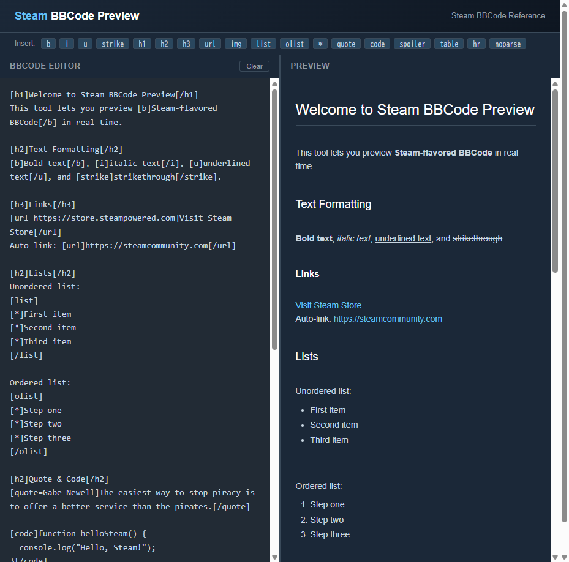

# Steam BBCode Preview

> Free online editor to write and preview **Steam-flavored BBCode** with a Steam-like dark theme.

**[Live Demo](https://youichi-uda.github.io/steam-bbcode-preview/)**



## Why this tool?

Steam uses a unique variant of BBCode with tags like `[h1]`, `[h2]`, `[h3]`, `[spoiler]`, `[olist]`, and `[table]` that **no other BBCode previewer supports**. If you write Steam Workshop guides, game descriptions, or community posts, you need a tool that actually understands Steam's formatting.

## Features

- **Real-time preview** — See rendered output as you type
- **Steam dark theme** — Preview matches Steam's actual look and feel
- **All Steam BBCode tags** — Including Steam-specific ones other tools miss
- **Tag toolbar** — One-click insertion with selection wrapping
- **XSS-safe** — All input is HTML-escaped before parsing
- **Zero dependencies** — Pure HTML/CSS/JS, no build step
- **Responsive** — Works on desktop (side-by-side) and mobile (stacked)

## Supported Tags

| Tag | Description |
|-----|-------------|
| `[b]`, `[i]`, `[u]`, `[strike]` | Bold, italic, underline, strikethrough |
| `[h1]`, `[h2]`, `[h3]` | Steam-styled headings |
| `[url=...]...[/url]` | Links (with or without explicit URL) |
| `[list][*]...[/list]` | Unordered list |
| `[olist][*]...[/olist]` | Ordered list |
| `[quote=author]...[/quote]` | Blockquote with attribution |
| `[code]...[/code]` | Code block |
| `[spoiler]...[/spoiler]` | Click-to-reveal spoiler text |
| `[table]`, `[tr]`, `[th]`, `[td]` | Tables |
| `[img]...[/img]` | Images |
| `[hr]` | Horizontal rule |
| `[noparse]...[/noparse]` | Disable BBCode parsing |

## Usage

### Online

Visit **[youichi-uda.github.io/steam-bbcode-preview](https://youichi-uda.github.io/steam-bbcode-preview/)** — no installation needed.

### Local

```bash
git clone https://github.com/youichi-uda/steam-bbcode-preview.git
cd steam-bbcode-preview
# Open index.html in your browser — that's it, no build step required
```

## Project Structure

```
├── index.html          # Main page
├── style.css           # Steam-like dark theme
├── bbcode-parser.js    # Steam BBCode → HTML parser
└── app.js              # Editor UI and real-time preview
```

## Security

User input is **HTML-escaped first**, then BBCode tags are converted. This prevents XSS attacks — `<script>alert(1)</script>` renders as plain text, not executable code. URLs are sanitized to block `javascript:` and `data:` protocols.

## Contributing

Contributions are welcome! Some ideas:

- **`[previewimg]`** / **`[previewyoutube]`** — Steam media embed tags
- **`[emoticon]`** — Steam emoticon images
- **Export** — Copy rendered HTML or BBCode to clipboard
- **Syntax highlighting** in the editor

## License

MIT
